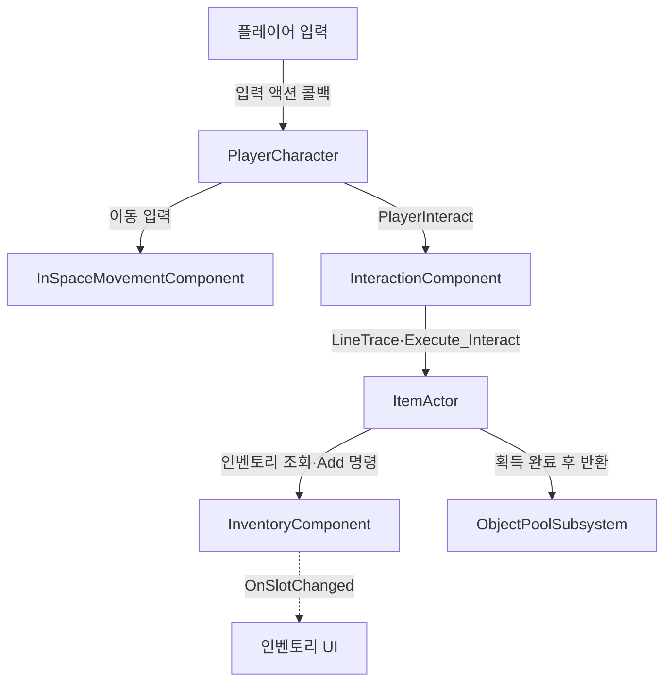
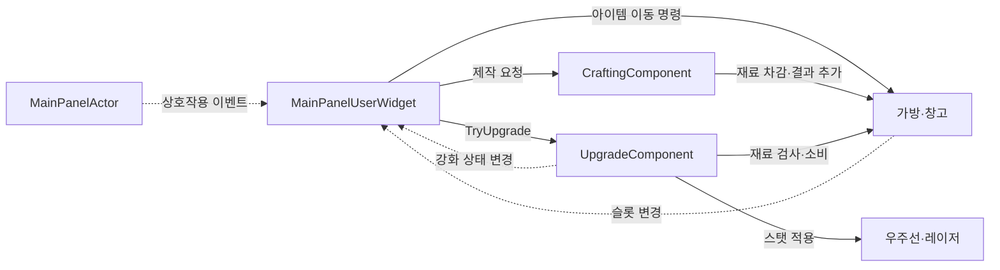
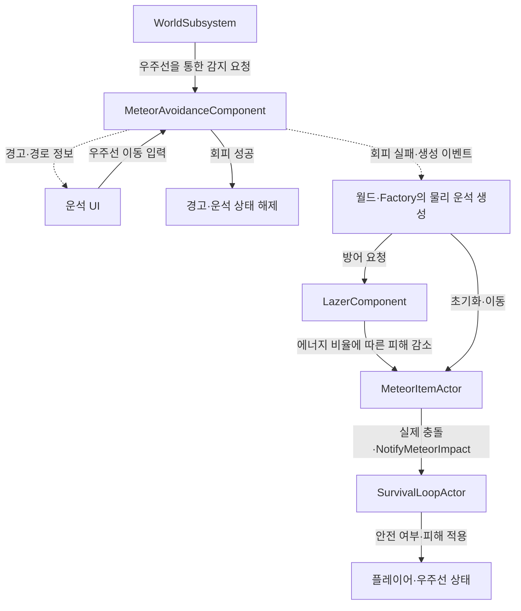
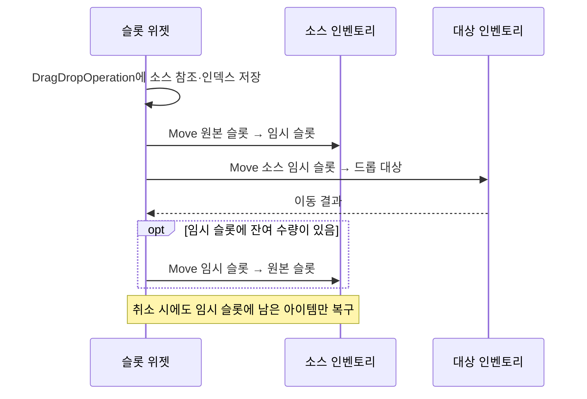
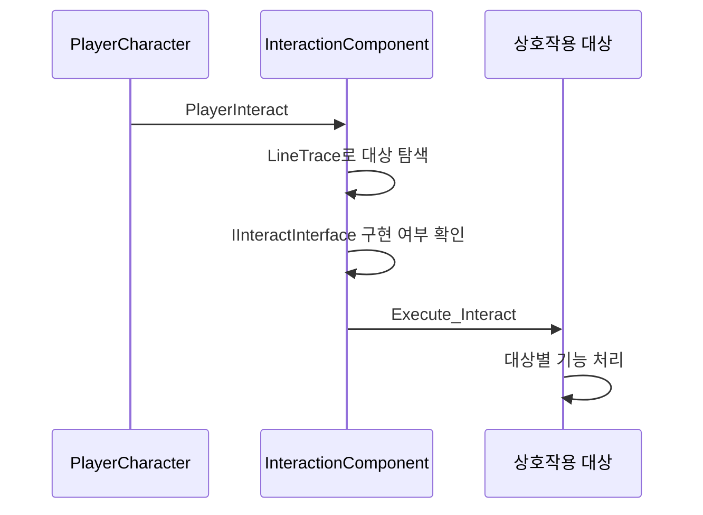
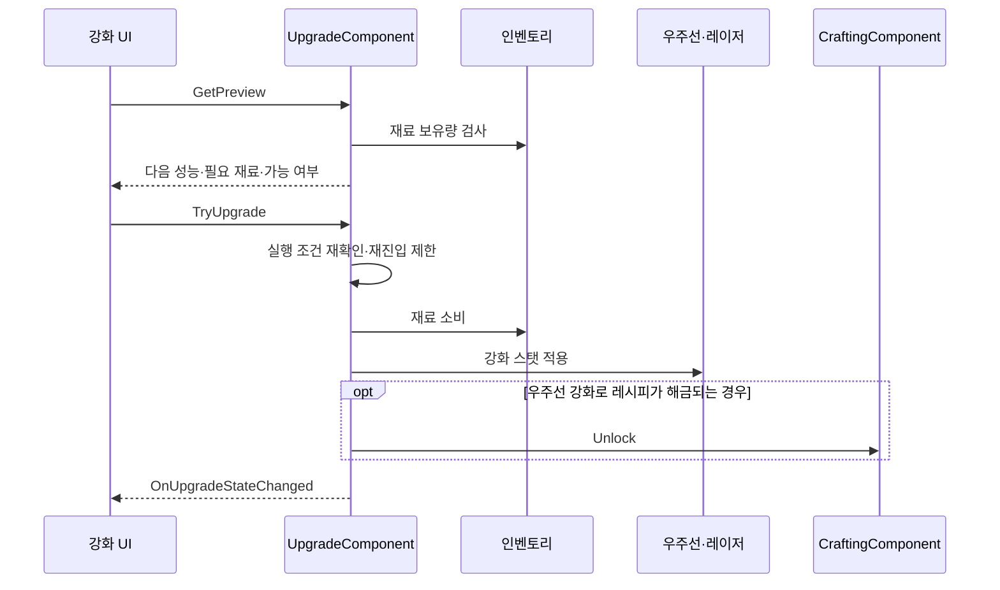
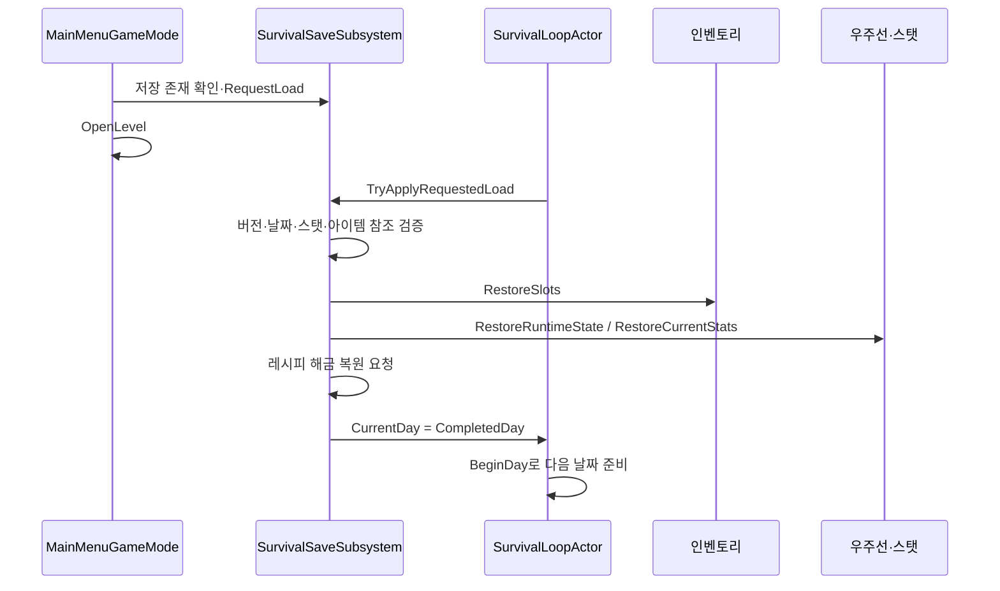
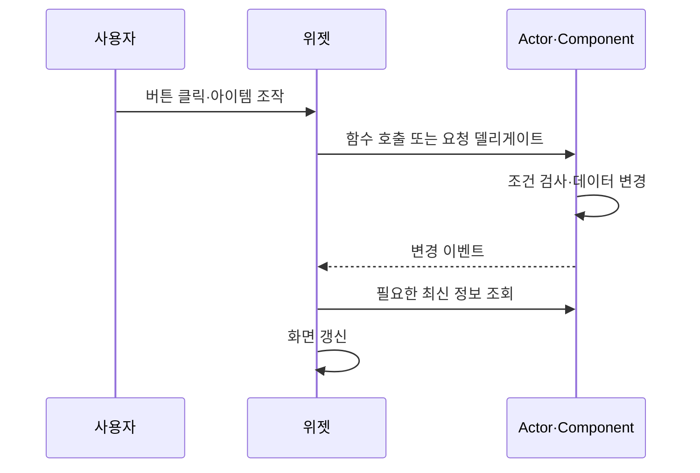
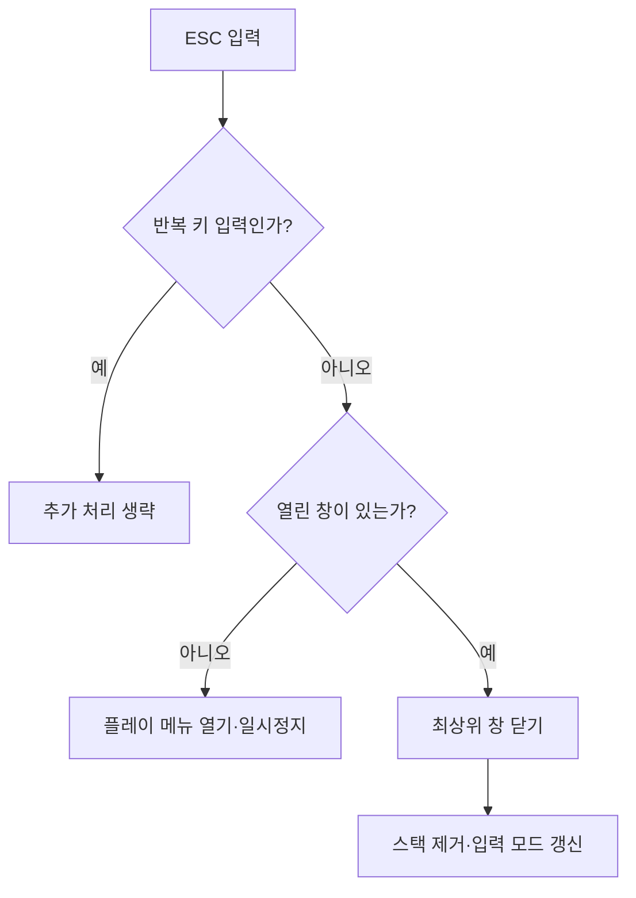

# ProjectSR 게임 시스템 기술문서

## 목차

- [1. 어떤 게임인가](#1-어떤-게임인가)
  - [1.1 게임 소개](#11-게임-소개)
  - [1.2 목표와 주요 행동](#12-목표와-주요-행동)
  - [1.3 한 번의 플레이 흐름](#13-한-번의-플레이-흐름)
- [2. 게임 진행에 따라 클래스가 협력하는 흐름](#2-게임-진행에-따라-클래스가-협력하는-흐름)
  - [2.1 흐름을 읽기 위한 주요 클래스](#21-흐름을-읽기-위한-주요-클래스)
  - [2.2 시작 버튼에서 생존 시작까지](#22-시작-버튼에서-생존-시작까지)
  - [2.3 하루 시작과 화면 표시](#23-하루-시작과-화면-표시)
  - [2.4 외부 탐색과 아이템 획득](#24-외부-탐색과-아이템-획득)
  - [2.5 귀환 후 보관·제작·강화](#25-귀환-후-보관제작강화)
  - [2.6 운석 경고에서 피해 판정까지](#26-운석-경고에서-피해-판정까지)
  - [2.7 하루 종료·다음 날·게임 종료](#27-하루-종료다음-날게임-종료)
- [3. 소개할 만한 주요 시스템과 구현 기술](#3-소개할-만한-주요-시스템과-구현-기술)
  - [3.1 비동기 생성과 오브젝트 풀](#31-비동기-생성과-오브젝트-풀)
  - [3.2 인벤토리 명령과 드래그 복구](#32-인벤토리-명령과-드래그-복구)
  - [3.3 제작 공간 예측과 강화 재료 일괄 적용](#33-제작-공간-예측과-강화-재료-일괄-적용)
  - [3.4 생존 상태 전환과 체크포인트](#34-생존-상태-전환과-체크포인트)
  - [3.5 커스텀 무중력 이동과 시간 기반 생존 판정](#35-커스텀-무중력-이동과-시간-기반-생존-판정)
  - [3.6 기하 기반 운석 회피와 에너지 비례 방어](#36-기하-기반-운석-회피와-에너지-비례-방어)
  - [3.7 이벤트 기반 UI와 열린 창 스택](#37-이벤트-기반-ui와-열린-창-스택)
  - [3.8 구현 근거와 검증 범위](#38-구현-근거와-검증-범위)

---

이 문서는 **어떤 게임인가 → 플레이 중 클래스가 어떻게 협력하는가 → 어떤 시스템을 어떻게 구현했는가** 순서로 설명한다. 먼저 플레이 경험을 이해한 뒤 실행 흐름을 따라가고, 마지막에 필요한 기술의 상세 구현을 읽을 수 있도록 구성했다.

## 1. 어떤 게임인가

### 1.1 게임 소개

ProjectSR은 우주선을 거점으로 주변 우주 공간을 탐색하고, 회수한 자원으로 우주선을 정비하며 목표 일수까지 버티는 생존 게임이다. 플레이어는 자신의 체력과 산소뿐 아니라 우주선의 에너지와 내구도도 함께 관리해야 한다.

탐색을 오래 할수록 자원을 더 얻을 기회가 생기지만 산소가 소모된다. 수집한 자원은 즉시 회복과 수리에 사용하거나, 제작·강화에 투자하여 이후의 위험에 대비할 수 있다. **탐색과 귀환 시점을 판단하고, 한정된 자원을 당장의 생존과 다음 날의 준비에 배분하는 것**이 핵심 경험이다.

### 1.2 목표와 주요 행동

| 구분 | 플레이 내용 |
|---|---|
| 탐색 | 우주선 밖으로 이동하여 주변 아이템을 수집한다. |
| 생존 | 체력과 산소를 확인하고, 산소가 고갈되기 전에 귀환하거나 회복한다. |
| 정비 | 가방과 창고에 자원을 정리하고 우주선 에너지·내구도를 보충한다. |
| 성장 | 아이템을 제작하고 우주선·레이저를 강화한다. |
| 위험 대응 | 운석 경고를 보고 회피하며, 레이저 방어에 필요한 에너지를 확보한다. |
| 장기 대비 | 3일마다 발생하는 태양풍을 견딜 내구도를 준비한다. |
| 성공·실패 | 목표 날짜의 정산과 피해를 견디면 클리어하고, 플레이어 사망 또는 우주선 파괴 시 실패한다. |

우주선 내부에 있고 문이 완전히 닫혀 있어야 안전한 상태가 된다. 문이 닫히는 도중에는 아직 안전 조건을 만족하지 않는다. 레이저는 물리 운석 생성 후 연결된 방어 흐름에서 작동하며, 확보한 에너지에 따라 효과가 달라진다.

목표 날짜의 C++ 기본값은 12일이지만 에디터에서 변경할 수 있다. 실제 콘텐츠 설정을 확인하기 전에는 고정된 12일 생존이 아닌 ‘설정된 목표 일수까지 생존’으로 설명한다.

### 1.3 한 번의 플레이 흐름


시작 버튼을 누르면 저장된 체크포인트가 있을 경우 이어하기를 요청한다. 하루가 시작되면 상태를 확인하고 탐색·수집·정비를 반복한다. 준비를 마치면 하루를 종료하고, 저장 및 환경 정리를 거쳐 다음 날로 진행한다. 진행 중 운석에 대응하고, 정해진 날짜에는 태양풍 피해를 견뎌야 한다.

## 2. 게임 진행에 따라 클래스가 협력하는 흐름

이 장은 클래스별 함수 목록보다 **플레이 중 어떤 일이 발생할 때 누가 요청을 받고 다음 객체에 무엇을 전달하는지**를 중심으로 설명한다. 다이어그램에서는 클래스의 A·U 접두사를 생략했다.

### 2.1 흐름을 읽기 위한 주요 클래스

| 역할 | 클래스 | 한 줄 설명 |
|---|---|---|
| 시작점 | AMainMenuGameMode | 시작 버튼에서 저장 확인과 게임 레벨 이동을 처리한다. |
| 진행 관리자 | ASurvivalLoopActor | 하루 시작·종료, 안전 판정, 성공·실패를 결정한다. |
| 환경 관리자 | USpaceSalvageWorldSubsystem | 필수 객체를 연결하고 아이템·운석의 생성과 정리를 조정한다. |
| 조작 주체 | APlayerCharacter | 입력을 이동·상호작용·인벤토리 기능에 전달한다. |
| 거점 | ASpaceShipActor | 우주선 상태와 창고·제작·강화·방어 기능을 연결한다. |
| 생성 지원 | UItemActorFactorySubsystem / UObjectPoolSubsystem | 아이템 리소스를 준비하고 Actor를 확보·재사용한다. |
| 자원 처리 | UInventoryComponent / UCraftingComponent | 가방·창고 데이터와 제작을 처리한다. |
| 성장 처리 | USpaceShipUpgradeComponent | 강화 조건을 확인하고 재료·성능을 변경한다. |
| 화면 연결 | ASRMainHUD / UMainUserWidget | 게임 객체를 하위 위젯에 연결하고 화면·입력 상태를 관리한다. |
| 진행 보존 | USurvivalSaveSubsystem | 완료 날짜 기준으로 저장·복원을 처리한다. |

### 2.2 시작 버튼에서 생존 시작까지

```mermaid
sequenceDiagram
    participant Menu as MainMenuGameMode
    participant Save as SurvivalSaveSubsystem
    participant Actors as Player / Ship / Loop
    participant World as WorldSubsystem
    participant Loop as SurvivalLoopActor
    Menu->>Save: 저장 확인·필요 시 RequestLoad
    Menu->>Menu: OpenLevel
    Actors->>World: 각자의 초기화 완료 후 Register
    World->>World: 필수 객체·자동 시작 조건 확인
    World->>Loop: 다음 Tick에서 StartSurvival
    Loop->>Save: TryApplyRequestedLoad
    Save-->>Loop: 복원 처리 결과
    Loop->>Loop: 시작 조건 검증·BeginDay
```

`MainMenuGameMode`는 저장 유무를 확인하고 게임 레벨로 이동한다. 레벨에 준비된 플레이어, 우주선, 생존 루프는 각자의 초기화 후 월드 서브시스템에 자신을 등록한다. 서브시스템은 모두 준비되면 다음 Tick에서 생존 시작을 요청한다.

`SurvivalLoopActor`는 요청된 저장 복원을 처리하고 시작 조건을 검증한다. 이후 날짜를 준비하고 `StartDay()`로 월드 환경을 시작한다. UI는 HUD와 메인 위젯을 통해 게임 객체 참조를 전달받고 현재 상태를 표시한다. 등록 순서는 고정되어 있지 않으므로 다이어그램은 논리적 연결 순서를 나타낸다.

### 2.3 하루 시작과 화면 표시

`SurvivalLoopActor.BeginDay__()`는 날짜에 맞는 맵 데이터를 선택한다. 첫날 이후에는 우주선 운용 에너지를 소비하고 플레이어를 회복시키며, 3일마다 태양풍 피해를 적용한다. 진행이 계속 가능한 상태라면 월드 서브시스템이 해당 맵의 아이템과 운석 발생 설정을 적용한다.

| 보내는 객체 | 전달 방식 | 받는 객체와 동작 |
|---|---|---|
| SurvivalLoopActor | StartDay 호출 | 월드 서브시스템이 환경 생성을 시작한다. |
| SurvivalLoopActor | OnDayStatusChanged | 날짜 위젯이 날짜·태양풍 정보를 갱신한다. |
| SpaceShipActor | OnEnergyChange / OnDurabilityChange | 우주선 상태·경고 위젯이 값을 표시한다. |
| StatComponent | OnHealthChanged / OnOxygenChanged | 플레이어 상태 위젯이 체력·산소를 표시한다. |

이후 플레이어는 화면에 표시된 상태를 바탕으로 탐색과 정비를 선택한다. UI는 상태의 원본을 보유하기보다 담당 객체의 값을 전달받거나 조회한다.

### 2.4 외부 탐색과 아이템 획득



이동 입력은 커스텀 이동 컴포넌트로 전달된다. 생존 루프는 플레이어 위치와 문 상태를 기준으로 안전 여부를 판단하고 중력 상태를 연결한다. 스탯 컴포넌트는 안전하지 않은 동안 산소를 소비하며 산소가 고갈되면 체력을 감소시킨다.

상호작용 입력이 들어오면 `InteractionComponent`가 대상을 탐색하고 인터페이스로 요청한다. 아이템은 플레이어 인벤토리에 추가를 요청하고, 획득이 완료되면 풀로 돌아간다. 슬롯 변경 이벤트를 받은 인벤토리 화면은 새 수량을 표시한다.

### 2.5 귀환 후 보관·제작·강화

플레이어가 메인 패널과 상호작용하면 `MainPanelActor`의 델리게이트가 `MainPanelUserWidget`을 연다. 패널은 우주선 창고, 제작, 강화 등의 하위 화면을 연결한다.



가방과 창고는 같은 인벤토리 컴포넌트를 사용하므로 이동·병합·사용 규칙을 공유한다. 제작은 양쪽 재료와 결과물 공간을 검사하며, 강화는 필요한 재료를 확인하고 우주선 또는 레이저 성능을 적용한다. 우주선 강화에 따라 레시피가 해금될 수도 있다.

### 2.6 운석 경고에서 피해 판정까지

월드 서브시스템이 운석 감지를 요청하면 우주선의 `MeteorAvoidanceComponent`가 경로와 경고 시간을 구성한다. 경고 위젯과 경로 위젯은 이벤트로 정보를 받고, 패널에서 들어온 이동 입력은 운석 경로를 조정하여 회피 가능 여부를 다시 검사한다.



회피 실패로 물리 운석이 생성되면 레이저 방어를 요청한다. 레이저는 우주선에서 확보한 에너지에 비례해 운석의 남은 충돌 피해를 줄인다. 살아남은 운석이 우주선과 충돌하면 생존 루프가 플레이어의 안전 여부와 우주선 피해를 처리한다.

컴포넌트의 `OnMeteorCollision`은 이름과 달리 이 단계에서 물리 운석 생성을 요청하는 이벤트이다. 실제 충돌은 운석 Actor에서 별도로 처리한다.

### 2.7 하루 종료·다음 날·게임 종료

```mermaid
sequenceDiagram
    participant Loop as SurvivalLoopActor
    participant UI as MainUserWidget
    participant World as WorldSubsystem
    participant Save as SurvivalSaveSubsystem
    Loop->>Loop: FinishDay·입력 잠금
    Loop->>World: EndOfDay로 생성 중단
    Loop-->>UI: OnDayFadeOut·열린 창 정리
    Loop->>Save: 페이드 완료 후 SaveCompletedDay
    alt 저장 성공
        Loop->>World: ClearDayActors
        Loop->>Loop: 플레이어 복귀·BeginDay
        Loop-->>UI: 페이드인·새 날짜 표시
    else 저장 실패
        Loop->>World: 현재 날짜 StartDay
        Loop-->>UI: 화면·입력 복구
    end
```

하루 종료 요청을 받으면 생존 루프가 입력을 잠그고 생성을 중단한다. UI는 열린 창을 정리하고, 페이드아웃 이후 완료 날짜를 저장한다. 저장 성공 후에만 이전 객체를 정리하고 플레이어를 복귀시켜 다음 날을 시작한다.

플레이어 사망이나 우주선 내구도 소진은 이벤트로 생존 루프에 전달된다. 실패 또는 클리어 시 환경을 중단하고 저장을 삭제한 뒤 `GameResultUserWidget`으로 결과를 표시한다. 결과 버튼은 다시 생존 루프에 메인 메뉴 이동을 요청한다.

## 3. 소개할 만한 주요 시스템과 구현 기술

앞 장의 실행 흐름을 바탕으로 구현상 특징이 뚜렷한 시스템을 정리한다. 각 항목은 해당 기능이 필요한 이유와 실제 데이터·처리 순서, 적용 범위를 함께 설명한다.


### 3.1 비동기 생성과 오브젝트 풀

주기적으로 등장하는 아이템을 재사용하면서 로딩 지연과 날짜 전환을 함께 처리하는 시스템이다. Factory는 리소스 준비, Pool은 Actor 수명, 월드 서브시스템은 배치를 담당한다.


#### 맵 데이터와 생성 규칙

| 데이터 | 의미와 사용 |
|---|---|
| `MapName` | 맵 표시 이름 |
| `ItemSpawnRate` | 아이템별 정수 가중치 |
| `ItemSpawnTime` | 아이템 생성 간격 |
| `ItemSpawnDist` | 생성 영역 거리 |
| `ItemMoveSpeed` | 아이템 이동 속도 기준 |
| `ItemSpawnInitCount` | 하루 시작 시 초기 생성 개수 |
| `MeteorData` | Factory로 생성할 운석 아이템 데이터 |
| `MeteorSpawnTime` | 운석 발생 시도 간격 |
| `MeteorSpawnRate` | 운석 발생 판정에 사용하는 0~1 확률 |
| `MeteorAlarmTime` | 운석 경고 시간 |
| `MeteorDamage`, `MeteorSpeed`, `MeteorSize` | 운석 피해·속도·지름 |

아이템 가중치와 운석 확률은 서로 다른 표현이다. 아이템은 가중치 합에서 난수를 선택하여 누적 구간에 해당하는 종류를 고른다. 운석은 `FRand()`와 0~1 범위로 제한한 발생률을 비교한다. `MeteorSpawnRate`의 주석에 퍼센트 표기가 있어도 실제 판정식 기준으로 0.3은 30%에 해당한다.


#### 배치와 회수

일반 아이템은 우주선을 중심으로 생성 방향을 정하고 안쪽으로 향하는 이동 방향을 계산한다. 직선 경로와 우주선 사이의 거리 제곱을 검사하여 안전 영역을 통과하지 않는 방향을 찾는다. 제한된 재시도 횟수 안에 방향을 찾지 못하면 그 생성 요청을 건너뛴다.

초기 아이템 생성과 주기적 생성은 별도 진입점을 사용하지만 실제 리소스 로딩과 Actor 획득은 Factory로 모인다. 배치된 아이템은 `ItemPivot`에 연결되며 상대 이동 속도를 설정받는다. 너무 멀어진 아이템과 날짜 종료 시 남은 아이템은 풀로 반환한다.

`EndOfDay()`는 생성 타이머를 멈추고, `ClearDayActors()`는 생성 세대를 변경하고 배치된 객체를 정리한다. 생성 중단과 기존 객체 정리를 구분하므로 날짜 전환 절차에서 필요한 시점에 각각 호출할 수 있다.


#### 풀 자료구조와 한도 정책

`UObjectPoolSettings`의 `PoolDataAssets`에 클래스별 설정을 등록한다. `UObjectPoolDataAsset`은 풀 대상 클래스, 초기 수량, 최대 수량, 한도 도달 정책을 정의한다. 초기 수량은 `Warmup()` 실행 시 미리 생성할 개수이며, 설정 등록 자체와 실제 예열은 구분한다.

현재 `FObjectPool`은 다음 컨테이너를 함께 사용한다. 레퍼런스의 과거 배열 설명과 달리 현재 활성 객체는 Set으로 관리한다.

| 멤버 | 자료구조 | 역할 |
|---|---|---|
| `ReadyActors` | `TArray<TObjectPtr<AActor>>` | 사용 대기 객체, Pop으로 재사용 후보 획득 |
| `ActiveActors` | `TSet<TObjectPtr<AActor>>` | 활성 객체 포함 여부와 참조 관리 |
| `ActiveActorOrderedList` | 이중 연결 리스트 | 활성화 순서, Head가 가장 오래된 객체 |
| `ActiveActorNodeMap` | Actor → 리스트 노드 맵 | 반환할 객체의 노드 검색 |
| `InitialSize`, `MaxSize`, `MaxPolicy` | 수량·정책 | 생성량과 한도 대응 |

| 정책 | 처리 |
|---|---|
| `DoNotSpawn` | 한도 도달 시 nullptr 반환 |
| `Grow` | 최대 수량을 넘어 새 객체 생성 |
| `ReuseOldest` | 리스트의 가장 오래된 활성 객체를 반환한 뒤 재사용 |

반환 시 활성 Set에서 제거하고 대기 배열에 넣으며, 순서 리스트와 노드 맵도 정리한다. `IPoolableInterface`를 구현한 Actor에는 생성·반환 훅을 호출한다. 구현하지 않았다면 표시, Tick, 충돌을 기본적으로 켜거나 끈다. 풀 자체를 정리할 때는 실제 Actor를 파괴한다.

**기술적 의미:** 객체 재사용뿐 아니라 활성 여부, 재사용 순서, 반환할 노드 검색을 서로 다른 자료구조로 처리한다. 다만 `Grow` 정책은 메모리 상한을 보장하지 않으며, 풀링 효과는 별도 프로파일링으로 확인해야 한다.


#### 비동기 로딩 수명

`SpawnItemActor()`는 리소스가 이미 로드된 경우에만 생성한다. `SpawnItemActorAsync()`는 로드된 데이터면 즉시 생성하고, 아직 준비되지 않았다면 `RequestDataLoad()` 완료 후 생성한다. 따라서 Async 함수의 콜백도 항상 다음 프레임에 호출된다고 가정해서는 안 된다.

진행 중인 `FStreamableHandle`은 `ActiveStreamableHandles__`에 보관한다. 완료된 핸들은 제거하고, 월드 종료 시 활성 핸들을 취소한다. 선택 인자인 `CanSpawn`은 로딩 전과 로딩 완료 후 검사하여 이미 취소된 날짜의 요청이 풀 객체를 먼저 가져가는 것을 줄인다. 이후 월드 콜백의 세대 검사도 수행한다.


#### 이전 날짜의 요청 결과 차단

아이템 로딩 중 날짜가 바뀌면 이전 날짜의 요청이 나중에 완료될 수 있다. 이를 구분하기 위해 생성 요청 시점의 `SpawnGeneration__`을 콜백에 보관한다.

완료 시에는 다음 조건을 확인한다.

- 현재도 생성이 허용되어 있는가?
- 요청 당시와 현재의 생성 세대가 같은가?
- 아이템을 연결할 대상이 유효한가?

조건이 맞지 않으면 해당 아이템을 배치하지 않고 풀로 반환한다. 약한 참조를 함께 사용하여 콜백 실행 시점의 객체 유효성도 확인한다.

이는 비동기 로딩 완료 여부뿐 아니라, **완료된 결과를 현재 게임 상태에서 사용해도 되는지**를 검사하는 처리이다.


### 3.2 인벤토리 명령과 드래그 복구

플레이어 가방과 우주선 창고가 같은 변경 규칙을 사용하도록 구성했다. UI의 표시와 실제 슬롯 데이터를 구분하고, 이동 실패나 부분 병합에서 남은 수량을 복구한다.


#### 아이템 정의와 사용 효과

`UItemDataAsset`은 한 종류의 아이템 정의를 저장한다. 인벤토리, 제작법, 월드 Actor, UI가 같은 정의를 참조하고 현재 수량 등 변하는 데이터는 슬롯이 관리한다.

| 데이터 | 용도 |
|---|---|
| ItemId | 아이템 식별 |
| ItemType | 자원·플레이어용·우주선용 구분 |
| DisplayName, Description | 이름·상세 정보 |
| MaxStackCount | 슬롯당 최대 수량 |
| ItemActorClass | 월드 표시 Actor 클래스 |
| Icon, Mesh | UI·월드 리소스 |
| ItemAction | 아이템 사용 효과 |

클래스, 아이콘, 메시 등의 Soft Reference는 필요할 때 로딩한다. `UItemAction` 계열은 실행자와 대상을 받아 효과를 수행한다. 배터리는 우주선 에너지 회복, 수리판은 내구도 인터페이스를 통한 수리, 산소통은 스탯 인터페이스를 통한 산소 회복을 담당한다.

아이템 효과와 보관 규칙을 구분하여, 인벤토리가 모든 효과의 세부 구현을 직접 알지 않고 정의된 액션을 실행하도록 한다. 이는 데이터와 동작을 연결하는 확장 지점이다.


#### 슬롯과 공통 명령

`FInventorySlot`은 아이템 참조, 수량, 드래그 상태를 담는다. `Slots_`는 일반 슬롯 `InventorySize`개와 임시 슬롯 1개를 가진다. 임시 슬롯 인덱스는 `InventorySize`이며, 일반 보관 공간과 구분하여 드래그 중 아이템을 보관한다.

| 명령 | 입력 정보의 예 | 기능 |
|---|---|---|
| Add | ItemData, Count | 스택·빈 슬롯에 추가, 남은 수량 반환 |
| Subtract | ItemData, Count | 요구 수량 차감, 미처리 수량 반환 |
| Search | ItemData, Count | 요구 수량 보유 여부 조회 |
| Move | 소스 인벤토리·소스 인덱스·대상 인덱스 | 이동·병합·교환 |
| Drop | TargetIndex, DropLocation | 월드 생성 요청 후 슬롯 정리 |
| Use | TargetIndex | 대상에 아이템 액션 실행 |
| Clear | TargetIndex | 슬롯 초기화 |
| ModifySize | Count | 인벤토리 크기 변경 |
| Equip | 명령의 대상 정보 | 장비 전용 핸들러로 분기 |

`ExecuteCommand()`는 명령 타입에 따라 핸들러를 호출하고 `FInventoryCommandResult`로 성공 여부와 미처리 수량을 전달한다. 특히 Add·Subtract는 일부 수량만 처리할 수 있으므로 성공 플래그만이 아니라 `RemainingCount`도 확인해야 한다.

슬롯 변경은 `OnSlotChanged`로 알린다. 아이콘 등 리소스가 아직 준비되지 않았다면 로딩 이후 해당 슬롯 갱신을 다시 요청할 수 있다. 단, 강화의 일괄 재료 처리는 아래의 별도 계획·적용 경로를 사용하므로 모든 슬롯 변경이 반드시 `SetSlot()`을 통한다고 설명하지 않는다.


#### 드래그 중 보관과 잔여 수량 복구



빈 슬롯에는 이동하고, 같은 아이템에는 최대 스택까지 병합하며, 다른 아이템에는 교환 처리를 한다. 병합 후 남은 수량이나 이동 실패로 남은 아이템은 소스 임시 슬롯에서 원래 슬롯으로 되돌린다. 취소 콜백도 임시 슬롯이 비어 있지 않은지 확인한 뒤 복구한다.

UI 표시용 드래그 이미지와 실제 아이템 보관 위치를 구분한다. 드래그 이미지는 임시 위젯이며, 실제 수량은 인벤토리 컴포넌트가 보유한다.


#### 대상 클래스에 덜 의존하는 상호작용



상호작용 컴포넌트는 대상별 세부 동작을 직접 구현하지 않는다. 아이템, 메인 패널, 문 버튼 등이 같은 인터페이스를 구현하고 각자의 기능을 수행한다.

따라서 새로운 상호작용 대상을 추가할 때 기존 입력 및 탐색 로직을 재사용할 수 있다.


### 3.3 제작 공간 예측과 강화 재료 일괄 적용

제작과 강화는 여러 인벤토리를 함께 사용하지만 변경 방식은 다르다. 제작은 결과 공간을 예측한 후 명령으로 처리하고, 강화 재료는 복사본에서 소비 계획을 완성한 뒤 일괄 적용한다.


#### 제작 이후 공간 예측

제작에서는 재료 수량과 결과물 저장 공간을 구분하여 검사한다.

저장 공간은 현재 빈 슬롯 수만으로 판단하지 않는다. 재료 소비로 비워질 슬롯과 기존 결과물 스택에 추가할 수 있는 수량도 고려한다.

이를 위해 인벤토리 슬롯 복사본에서 다음 과정을 수행한다.

1. 제작 재료를 가상으로 차감한다.
2. 기존 동일 아이템 스택에 결과물을 가상으로 추가한다.
3. 남은 결과물을 빈 슬롯에 배치한다.
4. 결과물을 모두 수용할 수 있는지 확인한다.

실제 인벤토리를 변경하지 않고 제작 이후의 공간을 예측하는 방식이다.


#### 레시피 데이터와 UI 전달

| 타입 | 주요 항목 | 목적 |
|---|---|---|
| FIngredient | ItemData, Quantity | 재료와 결과물 공통 표현 |
| FRecipeTableRow | RecipeName, Ingredients, Results, bLockedByDefault | 제작법 정의 |
| FRecipeEntry | 레시피 ID·이름·행 데이터 | 레시피 표시 단위 |
| FManufactureWidgetDisplayData | 레시피·현재 재료 수량·충족 여부·공간 여부 | 제작 상세 화면 데이터 |
| UnlockedRecipeIds | TSet의 레시피 ID | 런타임 해금 상태 |

레시피 선택 시 `OnRecipeSelected`가 `HandleRecipeSelected()`로 이어지고, 상세 데이터를 `OnManufactureWidgetOpened`로 전달한다. 제작 버튼은 `OnCraftRequested`로 요청하며 실제 `Craft()`에서 레시피·해금·재료·공간을 다시 확인한다. 성공 시 최신 상세 데이터를 다시 보내고 실패 시 `OnCraftFailed`를 알린다.


#### 강화 미리보기와 실행

`USpaceShipUpgradeComponent`는 강화 미리보기와 실행을 분리한다.

| 함수 | 역할 |
|---|---|
| `GetPreview()` | 다음 레벨과 성능, 필요 재료, 강화 가능 여부 조회 |
| `TryUpgrade()` | 조건 확인 후 재료 소비와 성능 적용 |
| `RestoreRecipeUnlocks()` | 우주선 성장 상태에 따른 레시피 해금 복원 |



미리보기 이후 인벤토리 상태가 달라질 수 있으므로, 실행 단계에서도 조건을 확인한다. 처리 중에는 재진입을 제한하여 강화가 중첩 실행되는 상황에 대응한다.


#### 재료 소비 계획과 이벤트 시점

`ProcessIngredients()`는 다음 순서로 처리한다.

1. 게임 스레드 호출인지 확인한다.
2. 같은 재료 항목의 요구 수량을 합산하고 잘못된 값·범위 초과를 검사한다.
3. 인벤토리 참조의 중복을 제거하고 슬롯 복사본을 만든다.
4. 일반 슬롯 중 드래그 중이 아닌 슬롯에서 소비 계획을 계산한다.
5. 어느 재료든 부족하면 실제 인벤토리를 변경하지 않고 실패한다.
6. 소비 요청이라면 모든 인벤토리에 계획을 먼저 적용한다.
7. 전체 적용 완료 후 변경 슬롯 이벤트를 보낸다.

**기술적 의미:** 재료 부족이 나중에 확인되어 앞쪽 인벤토리만 차감되는 상황을 피하고, 이벤트 수신자가 중간 상태를 관찰하지 않도록 순서를 제어한다. 이는 게임 스레드에서의 재료 일괄 처리에 대한 성질이며, DB 트랜잭션이나 제작·강화 전체의 롤백을 제공한다는 의미는 아니다. 제작의 Add·Subtract 명령 경로와도 구분해야 한다.


#### 강화 결과와 제약

| 결과 | 의미 |
|---|---|
| Success | 강화 가능 또는 실행 성공 |
| MaxLevel | 다음 단계 없음 |
| NotEnoughIngredients | 재료 부족 |
| RequiresHigherShipLevel | 우주선 레벨 조건 미충족 |
| InvalidData | 데이터나 대상 설정 오류 |
| Busy | 강화 처리 중 |

현재 조건식은 레이저의 다음 레벨이 우주선 현재 레벨 이상이면 차단한다. 예를 들어 우주선 2레벨에서 레이저 2레벨로 올리는 요청은 허용되지 않는다. 우주선 강화 적용은 최대 스탯과 창고 크기뿐 아니라 현재 내구도·에너지를 새 최대값으로 설정한다. 저장 복원은 이 강화 함수를 재사용하지 않고 별도 복원 함수로 저장된 현재량을 적용한다.


### 3.4 생존 상태 전환과 체크포인트

날짜 전환은 입력·환경·저장·화면 상태가 함께 바뀌는 구간이다. 상태 검사와 처리 순서를 사용하여 중복 전환을 제한하고 실패 시 복구 경로를 둔다.


#### 진행 상태와 관리 데이터

하루 시작과 종료, 일일 정산, 안전 구역 판정, 게임 종료를 관리하는 Actor이다.

| 항목 | 역할 |
|---|---|
| `State` | 현재 생존 진행 상태 |
| `CurrentDay` | 현재 날짜 |
| `FinalDay` | 클리어 판정에 사용하는 목표 날짜 |
| `Maps` | 시작 날짜별 맵 데이터 |
| `SpaceShip` | 관리 대상 우주선 |
| `Player` | 관리 대상 플레이어 |
| `InteriorBounds` | 우주선 내부 판정 영역 |

상태는 다음과 같이 구분한다.

| 상태 | 의미 |
|---|---|
| `Ready` | 생존 시작 전 |
| `Playing` | 플레이 진행 중 |
| `WaitingForMeteor` | 현재 구현에서 하루 종료 전환을 처리하는 상태 |
| `GameOver` | 생존 실패 |
| `Cleared` | 목표 달성 |

각 진행 함수는 현재 상태를 확인한 뒤 실행한다. 예를 들어 `FinishDay()`는 `Playing` 상태에서만 동작하므로, 날짜 전환 중 발생하는 추가 종료 요청을 제한한다.


#### 날짜 데이터 선택과 일일 정산

`FSurvivalMapEntry`는 `StartDay`와 `MapData`를 묶는다. 하루 시작 시 적용 가능한 항목 중 가장 큰 시작 날짜를 선택한다. 예를 들어 시작일이 1, 4, 7인 항목이 있다면 5일에는 4일 항목의 데이터를 사용한다. 매일 별도 맵 데이터를 작성하지 않고 일정 구간에 같은 환경 설정을 적용할 수 있다.

| 설정 | C++ 기본값 | 의미 |
|---|---|---|
| `LowEnergyOxygenRatio` | 0.7 | 일일 운용 에너지가 부족할 때 산소 보충 목표 비율 |
| `DailyHealthRecoveryRatio` | 0.5 | 하루 정산 시 최대 체력을 기준으로 더하는 회복량 비율 |
| `FirstSolarWindDamage` | 10 | 첫 태양풍 피해 |
| `SolarWindDamageIncrease` | 5 | 태양풍 발생 차수별 증가량 |
| `DayFadeOutDuration` / `DayFadeInDuration` | 각각 0.75초 | 날짜 전환 페이드 시간 |

이 값은 소스 기본값이며 Blueprint·레벨에서 덮어쓸 수 있다. 태양풍 피해는 `첫 피해 + (발생 차수 - 1) × 증가량`으로 계산한다. 기본값 기준 3·6·9·12일 피해는 10·15·20·25이다. 내구도가 피해와 같으면 0이 되므로 다음 피해보다 높은 내구도를 확보해야 생존한다.

산소 회복은 현재 산소를 목표치로 강제 대입하지 않는다. 현재량이 목표보다 낮을 때 부족분만 보충하므로 기존 산소가 줄지 않는다. 체력은 최대 체력의 설정 비율만큼 가산하고 최대치로 제한한다.


#### 입력 잠금과 전환 완료 시점

날짜 전환에서는 이동·시점 입력을 제한하고 이동 컴포넌트 Tick을 잠근다. 잠그기 전 입력과 Tick 상태를 보관한 뒤 복구 시 사용한다. 페이드아웃은 Tick에서 남은 시간을 감소시키며, 0초 전환도 다음 Tick에서 완료되어 전환 상태가 관찰 가능하도록 구성되어 있다.

**기술적 의미:** 날짜 변경을 숫자 증가로만 처리하지 않고 입력, 저장, 환경 수명, 화면 전환을 하나의 순서로 관리한다. 특히 저장 성공 전 환경을 정리하지 않는 순서는 실패 시 현재 날짜를 재개하는 근거가 된다.


#### 저장 데이터의 범위

| USurvivalSaveGame 필드 | 저장 내용 |
|---|---|
| SaveVersion | 저장 형식 버전, 현재 1 |
| CompletedDay | 마지막으로 완료한 날짜 |
| PlayerHealth / PlayerOxygen | 플레이어 현재량 |
| SpaceShipStat / LazerStat | 우주선·레이저 성능 |
| SpaceShipDurability / SpaceShipEnergy | 우주선 현재량 |
| PlayerInventorySize / PlayerInventory | 가방 크기·일반 슬롯 |
| WarehouseSize / Warehouse | 창고 크기·일반 슬롯 |

`FInventorySlotSaveData`는 아이템 데이터의 Soft Object 참조와 수량을 저장한다. 월드의 모든 Actor 위치나 임시 드래그 슬롯을 저장하는 방식이 아니라 완료 날짜 기준의 생존 상태를 보존한다. 현재 저장 구조에는 장착 Actor 목록과 개별 장비 수정치가 포함되어 있지 않다.


#### 복원 순서와 아이템 검증



아이템 배열 길이, 아이템 참조, 양수 수량, 최대 스택 제한을 확인하고 플레이어·창고 슬롯을 해석한 뒤 적용한다. 이 단계의 아이템 참조 해석은 `LoadSynchronous()`를 사용한다. 따라서 저장 복원까지 전부 비동기 로딩이라고 표현하지 않는다.

복원 시 드래그 상태를 초기화하고 임시 슬롯을 새로 추가한다. 우주선의 저장된 현재량을 복원한 후 현재 레벨에 따라 레시피 해금을 복원하고, 화면에 현재 상태를 다시 알린다.


#### 저장·복원 실패 처리

`USurvivalSaveSubsystem`은 완료한 날짜의 진행 상황을 저장하고, 요청된 저장 데이터를 생존 시작 과정에서 복원한다.

| 처리 시점 | 호출 | 역할 |
|---|---|---|
| 생존 시작 | `TryApplyRequestedLoad()` | 요청된 체크포인트 복원 |
| 하루 종료 | `SaveCompletedDay()` | 완료 날짜 저장 |
| 게임 오버 | `DeleteSaveGame()` | 저장 데이터 삭제 |

필수 플레이어·우주선 컴포넌트가 없거나 복원 적용을 진행할 수 없어 false가 반환되면 생존 시작을 중단한다. 반면 저장 파일 누락·손상·지원하지 않는 버전·잘못된 저장 값은 `StartFreshAfterInvalidCheckpoint` 경로에서 로드 요청을 해제하고 새 게임으로 진행한다. 기존 체크포인트는 즉시 삭제하지 않으며 다음 정상 자동 저장으로 대체한다. 하루 종료 시 저장에 실패하면 현재 날짜를 재개한다.


#### 결과 표시와 저장 정리

게임 오버와 클리어 모두 환경을 중단하고 체크포인트를 삭제한다. 결과 위젯은 `SetResult()`로 제목·설명을 설정받고 메인 메뉴 버튼을 누르면 델리게이트로 이동을 요청한다. 결과 표시 중에는 게임을 일시정지하고 UI 입력 모드를 사용한다.

종료 이유는 `ShipDestroyed`, `PlayerDied`, `MeteorCollision`, `SolarWind`로 구분한다. 루프 내부에서 피해 원인을 임시 보관하므로 동일한 내구도 소진이라도 태양풍과 일반 파괴를 다른 결과 설명으로 표시할 수 있다.


### 3.5 커스텀 무중력 이동과 시간 기반 생존 판정

이동 모드, 내부 위치, 문 완료 상태를 생존 규칙에 연결한다. 산소 고갈 경계에서는 실제 무산소 시간만 피해에 반영한다.


#### 이동 모드와 물리 계산

`UInSpaceMovementComponent`는 CharacterMovement의 `MOVE_Custom`과 `CMOVE_ZeroGravity`를 사용한다. `PhysCustom()`에서 무중력 물리 함수로 분기하므로 기존 CharacterMovement의 이동 구조 안에서 기능을 확장한다.

1. 무중력 진입 시 중력 배율을 0으로 설정한다.
2. 이동 방향 자동 회전 대신 컨트롤러의 Yaw·Pitch를 따라가도록 설정한다.
3. `CalcVelocity()`로 마찰·감속이 반영된 속도를 계산한다.
4. `SafeMoveUpdatedComponent()`로 충돌을 고려한 이동을 시도한다.
5. 충돌 시 법선과 반발계수를 이용한 속도 조정 및 `SlideAlongSurface()`를 수행한다.
6. 텔레포트가 아니라면 실제 이동 거리를 시간으로 나누어 속도를 갱신한다.

무중력 이탈 시 `MOVE_Falling`으로 전환하여 엔진이 바닥 감지 후 적절한 이동 상태로 진행하도록 한다. 이 구조만으로 멀티플레이 예측·복제가 완성되었다고 볼 수는 없으며 본 문서는 현재 로컬 게임 동작만 설명한다.


#### 안전 구역과 산소 소비

생존 루프는 플레이어가 내부 영역에 있고 우주선 문이 닫혀 있는지를 확인하여 안전 여부를 판단한다.

안전 여부에 따라 이동 컴포넌트의 중력 모드를 전환한다. 플레이어는 중력 변경 시 산소 소비 플래그도 설정하지만, 생존 루프가 연결된 실제 생존 모드에서는 `UStatComponent`가 `IsPlayerSafe()` 결과를 우선 사용한다. 따라서 산소 소비는 이동 모드만이 아니라 내부 위치와 문의 실제 상태를 기준으로 결정된다.

이러한 연결을 통해 외부 활동에는 산소 관리가 필요하며, 플레이어가 탐색 시간과 귀환 시점을 판단하도록 한다.


#### 부분 프레임 질식 피해

`UStatComponent`는 `InitializeComponent()`에서 기본 스탯을 초기화한다. 초기화 완료 플래그로 중복 초기화를 제한하고 `BeginPlay()`에서는 확정된 값을 UI에 알린다.

외부 활동 시 산소는 `소비율 × DeltaTime`만큼 감소한다. 산소가 프레임 도중 고갈되면 그 프레임 전체가 아니라 산소 없이 보낸 시간만큼 체력 피해를 준다.

```text
산소로 버틸 시간 = 현재 산소 / 초당 소비율
산소 없는 시간 = max(0, DeltaTime - 산소로 버틸 시간)
체력 피해 = 초당 질식 피해 × 산소 없는 시간
```

예를 들어 산소가 0.02초를 버틸 만큼 남은 상태에서 0.05초 프레임이 처리되면 질식 피해는 0.03초분이다. 이미 산소가 0이었다면 전체 프레임 시간을 사용한다. 이는 산소 고갈 경계에서 프레임 길이 때문에 피해가 과도하게 계산되는 것을 줄인다.

스탯 변경 요청은 `FStatChangeCommand`를 통해 체력·산소 종류, 변화량, 변경 원인을 전달한다. 명령 기록은 설정된 최대 길이로 제한한다. 모든 스탯 변경이 명령을 통하는 것은 아니며 복원과 일일 회복에는 별도 경로도 있다.


#### 장비와 애니메이션 데이터 연결

`UEquipItemAction`은 장비 컴포넌트로 Actor를 장착하고, 스탯 컴포넌트에 장비 수정치를 전달한 뒤 이동 속도를 갱신한다. 장비 Actor는 슬롯에 대응하는 메시 소켓에 붙인다. 같은 슬롯의 기존 장비는 먼저 해제한다.

| 장비 슬롯 | 연결 소켓 |
|---|---|
| SpaceSuit | Body_Socket |
| DragMachine | RightHand_Socket |
| Weapon | LeftHand_Socket |

현재 수정치 적용은 전달받은 수정치로 최대 스탯을 재계산하는 방식이다. 여러 장비 효과의 누적 집계나 해제 시 자동 역산 전체를 구현했다고 설명하지 않는다.

`UPlayerAnimInstance`는 캐릭터와 이동 컴포넌트를 참조하여 평면 속도, 3차원 속도, 낙하, 가속, 부스트, 웅크림, 무중력 상태를 갱신한다. `UnrotateVector()`로 월드 속도를 캐릭터 로컬 속도로 변환하여 방향별 무중력 애니메이션에 사용할 데이터를 제공한다. 실제 애니메이션 그래프 구성은 Blueprint 확인 범위이다.


### 3.6 기하 기반 운석 회피와 에너지 비례 방어

운석의 경고 단계와 실제 충돌을 구분한다. 경고 중에는 경로와 우주선 사이의 거리로 회피를 판단하고, 물리 운석 단계에서는 에너지를 사용해 충돌 피해를 줄인다.


#### 우주선·레이저 데이터

| 구조체 | 주요 필드 | 역할 |
|---|---|---|
| `FSpaceShipStat` | Level, MaxDurability, MaxEnergy, OperationalEnergy, MaxCapacity, MoveSpeed | 우주선 등급·수용량·에너지·이동 기준 |
| `FLazerStat` | Level, Damage, ReactiveEnergy, OperationalEnergy | 레이저 성능과 에너지 설정 |
| `FSpaceShipUpgrade` | Level, SpaceShipStat, Ingredients, UnlockRecipeIds | 다음 우주선 단계와 비용·해금 |
| `FLazerUpgrade` | Level, LazerStat, Ingredients | 다음 레이저 단계와 비용 |

현재 하루 정산은 우주선의 `OperationalEnergy`를 사용한다. 레이저 구조체의 `OperationalEnergy` 필드가 존재한다는 이유만으로 별도의 레이저 유지비가 자동 합산된다고 설명하지 않는다.


#### 경로와 안전 반지름을 이용한 회피

운석 감지 시 `FMeteor`에 남은 시간, 피해, 속도, 크기, 시작점, 끝점과 이동 방향을 구성한다. 이동 입력은 우주선 중심 좌표계에서 운석 경로를 반대 방향으로 이동시키는 방식으로 반영한다.

`EvaluateMeteorAvoidance()`는 원점인 우주선 중심에서 운석 경로 직선까지의 거리 제곱을 계산한다. 비교 기준은 운석 반지름과 우주선 안전 반지름을 합한 값의 제곱이다.

```text
충돌 기준 거리² = (운석 지름 × 0.5 + 우주선 안전 반지름)²
경로까지 거리² > 충돌 기준 거리² 이면 회피 성공
```

회피에 성공하면 경고 타이머와 운석 상태를 정리한다. 경고 시간이 끝날 때까지 회피하지 못하면 물리 운석 생성 이벤트를 보낸다. 화면에는 `OnMeteorDetect`, `OnMeteorMove`, `OnMeteorTimer`, `OnMeteorClear`로 상태를 전달한다.


#### 확보한 에너지에 비례한 방어

`RequestEnergy()`는 요청량과 현재 에너지 중 작은 값을 반환하고 실제 사용량을 차감한다. 레이저는 확보한 에너지 비율에 따라 효과를 계산한다.

```cpp
// ULazerComponent::AttackMeteo__의 핵심 계산
const float RequestedEnergy = SpaceShip->RequestEnergy(this->LazerStat__.ReactiveEnergy);
const float LazerDamage = this->LazerStat__.Damage * RequestedEnergy / this->LazerStat__.ReactiveEnergy;
```

예를 들어 요구 에너지가 10이고 기본 효과가 20일 때 5의 에너지만 확보하면 효과는 10이다. 운석의 `LazerDamage()`는 남은 충돌 피해를 감소시키며 0이 되면 운석을 풀로 반환한다. 레이저 에너지 부족은 방어 불가와 완전 방어 사이의 부분 방어로 표현된다.


#### 문 완료 상태와 중복 충돌 방지

`IsDoorClosed()`는 문 열림 플래그뿐 아니라 문 이동 타이머가 종료되었는지도 검사한다. 따라서 닫기 버튼을 누르는 즉시 안전해지는 것이 아니라 닫힘 동작이 끝나야 안전 조건을 만족한다.

물리 운석은 `bImpactResolved__`로 중복 충돌을 제한하고, 처리 시작 시 충돌·Tick·이동을 중단한다. 피해 처리와 함께 효과음, Niagara 효과, 카메라 흔들림을 실행한다. 이 구조는 연속 Overlap으로 같은 운석의 피해가 반복 적용되는 것을 제한한다.


### 3.7 이벤트 기반 UI와 열린 창 스택

UI는 상태를 표시하는 것과 함께 입력 모드·포커스·창 닫기 순서를 관리한다. 변경 이벤트로 표시를 갱신하고, UI가 열린 동안 필요한 게임 조작은 별도 입력 경로로 연결한다.


#### 화면과 담당 객체

`ASRMainHUD`는 `UMainUserWidget`을 생성하고 플레이어, 우주선, 생존 루프 참조를 전달한다. 메인 위젯은 하위 화면에 필요한 객체를 연결한다.

| 화면 | 연결 대상 | 표시·처리 내용 |
|---|---|---|
| 플레이어 상태 | `UStatComponent` | 체력·산소 |
| 우주선 상태 | `ASpaceShipActor` | 에너지·내구도 |
| 인벤토리 | `UInventoryComponent` | 슬롯·수량·아이템 정보 |
| 제작창 | `UCraftingComponent` | 레시피·재료·제작 가능 여부 |
| 강화창 | `USpaceShipUpgradeComponent` | 다음 성능·재료·강화 가능 여부 |
| 날짜 표시 | `ASurvivalLoopActor` | 현재 날짜·태양풍 관련 정보 |
| 운석 경고 | `UMeteorAvoidanceComponent` | 운석 감지·남은 시간 |


#### 요청과 결과 통지



위젯은 게임 상태의 원본을 직접 관리하지 않고, 담당 객체의 데이터를 조회하거나 전달받아 표시한다. 상태 변경은 델리게이트를 통해 알린다.

하나의 이벤트를 여러 위젯이 구독할 수 있으므로, 우주선 내구도 변화에 상태 표시와 경고 UI가 각각 반응할 수 있다. 상태 관리 클래스가 각 위젯의 표시 함수를 직접 호출하는 의존도도 줄어든다.


#### 위젯별 책임

| 위젯 | 책임 |
|---|---|
| UInventoryWindowWidget | 창 열기·닫기, 용량 표시 |
| UItemManagerWidget | 슬롯 목록 구성, 선택 아이템 상세, 사용·버리기 요청 |
| UInventorySlotWidget | 단일 슬롯 표시, 선택과 드래그 앤 드롭 |
| UMainPanelUserWidget | 우주선 메뉴 페이지 전환과 하위 화면 연결 |
| URecipeListWidget / UManufactureWidget | 레시피 선택과 제작 상세 |
| UShipUpgradeDetailUserWidget | 강화 미리보기와 실행 요청 |
| UPlayMenuUserWidget | 일시정지·재개·종료 |
| UGameResultUserWidget | 성공·실패 제목, 설명, 메인 메뉴 이동 요청 |

인벤토리 화면은 소유자가 플레이어인지 우주선인지보다 전달받은 인벤토리 참조를 기준으로 동작한다. 상태 위젯과 제작 위젯도 필요한 컴포넌트 참조를 바인딩하여 동일한 게임 데이터를 표시한다.


#### 열린 창과 ESC 처리

`UMainUserWidget`은 `OpenWidgetStack__`에 열린 창을 관리한다. 등록 대상은 `IOpenableWidgetInterface`를 구현해야 하며 중복 등록을 제한한다. 창이 있으면 UIOnly 입력 모드와 커서를 사용하고, 스택이 비면 GameOnly로 복귀한다.



ESC를 누르고 있을 때 여러 창이 연속으로 닫히지 않도록 반복 키를 구분한다. 닫기 자체와 닫힘 델리게이트가 모두 제거를 요청하더라도 객체 식별로 제거하여 중복 통지를 처리한다. 날짜 페이드아웃 시에는 창 스택을 비우고 HUD를 숨기며 페이드인에서 다시 표시한다.

상태 위젯은 이벤트 기반으로 갱신하지만 모든 UI와 게임 로직이 이벤트만으로 작동하는 것은 아니다. 애니메이션, 이동, 산소 소비처럼 연속 변화가 필요한 로직은 Tick을 사용한다.


#### 초기 표시와 UI 전용 입력

플레이어·우주선 참조를 바인딩한 뒤 `InitBroadCast()`를 호출하고, 생존 루프 바인딩 후에는 `InitDelegate()`를 호출한다. 이미 초기화 시점의 이벤트가 지나갔더라도 현재 상태를 화면에 다시 전달하기 위한 흐름이다.

메인 패널이 열린 동안에는 UIOnly 모드이므로 일반 캐릭터 입력에만 의존할 수 없다. 메인 위젯의 PreviewKeyDown 경로에서 패널의 운석 이동 키 처리를 전달하여 UI가 열려 있는 상태의 회피 조작을 연결한다.

#### 개발 환경

| 항목 | 소스에서 확인한 내용 |
|---|---|
| 엔진 연결 | `.uproject`의 `EngineAssociation`: 5.8 |
| 런타임 모듈 | `ProjectSR` |
| 주요 의존성 | EnhancedInput, UMG, Slate, Niagara 등 |
| 기본 시작 맵 | `/Game/FirstPerson/Lvl_FirstPerson` |
| 기본 GameMode | `MainMenuGameMode` |
| 게임 인스턴스 | 기본 `Engine.GameInstance`와 별도 저장 서브시스템 사용 |

기능 상자는 별도 Unreal 모듈을 의미하지 않는다. 동일한 런타임 모듈 안에서 책임에 따라 클래스를 나눈 논리적 구분이다. Shooter/Horror 변형 코드도 소스에 존재하지만, 아래 본문은 우주 생존 기능의 연결을 중심으로 설명한다.
